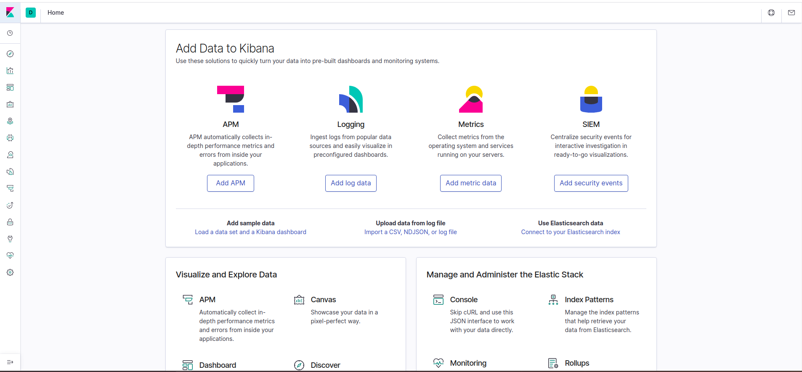

# Run Elasticsearch and Kibana

```bash
docker-compose up -d
```

This will run the `elastisearch` and `kibana` running with the network create prior.

Elasticsearch : [http://localhost:9200/](http://localhost:9200/)

Expected Output:

```bash
{
  "name" : "es-node-one",
  "cluster_name" : "monitoring-cluster",
  "cluster_uuid" : "ZWPACU7PQkiDrakiIq5yFw",
  "version" : {
    "number" : "7.5.1",
    "build_flavor" : "default",
    "build_type" : "docker",
    "build_hash" : "3ae9ac9a93c95bd0cdc054951cf95d88e1e18d96",
    "build_date" : "2019-12-16T22:57:37.835892Z",
    "build_snapshot" : false,
    "lucene_version" : "8.3.0",
    "minimum_wire_compatibility_version" : "6.8.0",
    "minimum_index_compatibility_version" : "6.0.0-beta1"
  },
  "tagline" : "You Know, for Search"
}
```

Kibana: [http://localhost:5601/](http://localhost:5601/)

Expected Output:


